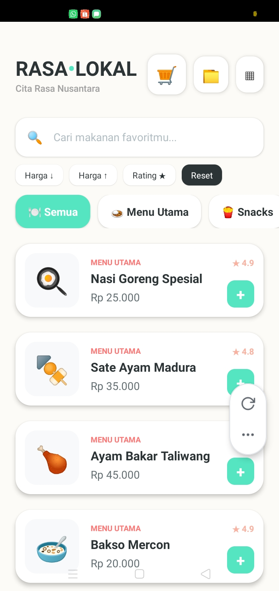
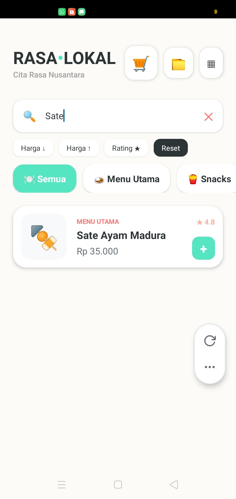
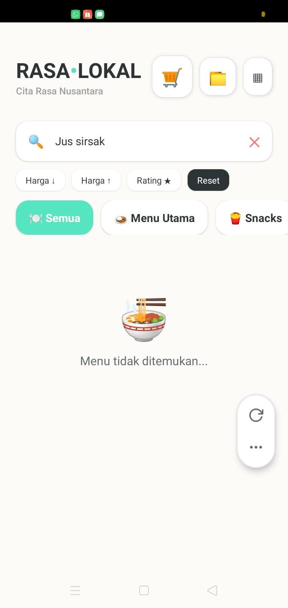
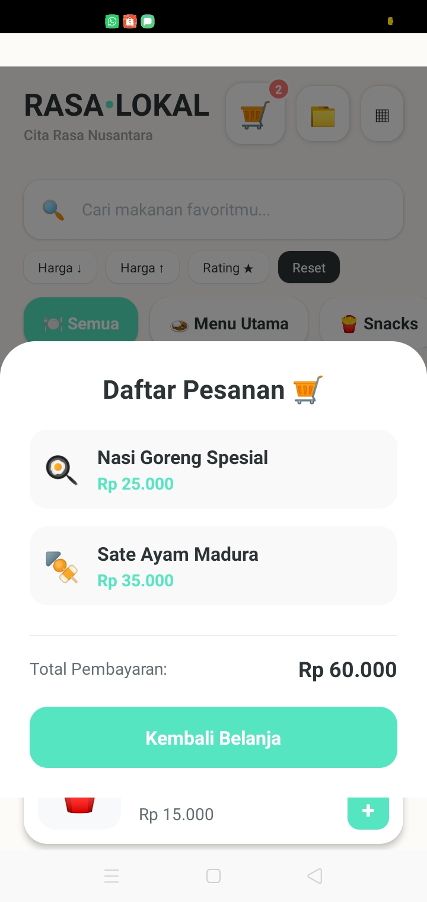

# ShopList App - Pemrograman Mobile Pertemuan 6

## Nama & NIM
- Nama:RISKEN SITORUS
- NIM: 243303621292

## Fitur yang Diimplementasikan
- [x] FlatList dengan 12+ produk
- [x] Custom ProductCard component (file terpisah)
- [x] keyExtractor dengan ID unik
- [x] ListEmptyComponent (empty state)
- [x] Search / Filter real-time
- [x] Pull-to-Refresh
- [X] Filter Kategori (E1) — isi jika dikerjakan
- [X] Toggle List/Grid View (E2) — isi jika dikerjakan
- [X] SectionList Mode (E3) — isi jika dikerjakan
- [X] Sort Produk (E4) — isi jika dikerjakan

## Screenshot
### Tampilan Utama (List Produk)

### Tampilan Search — saat ada hasil

### Tampilan Empty State — saat tidak ada hasil

### Tampilan Bonus — saat membuka keranjang

## Cara Menjalankan
1. Clone repo  : git clone [https://github.com/riskensitorus/pemmobile-p06-risken]
2. Install deps: npm install
3. Jalankan    : npx expo start
4. Scan QR Code dengan Expo Go di HP